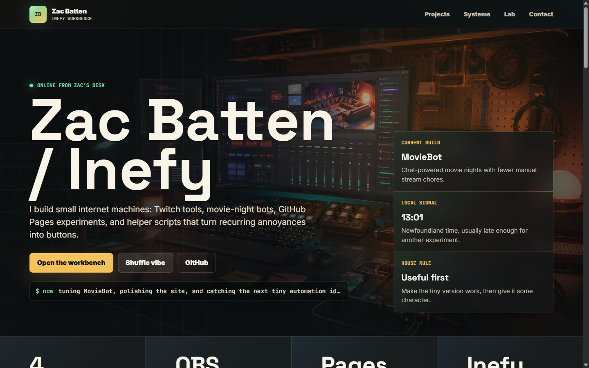

# Zac Batten Portfolio / Inefy Workbench

Static GitHub Pages portfolio for [zacbatten.me](https://zacbatten.me). The site presents Zac Batten as a software developer through selected project work, case studies, practical web tools, build notes, and contact/resume paths.



## Live Links

- Portfolio: [zacbatten.me](https://zacbatten.me)
- MovieBot case study: [zacbatten.me/moviebot-case-study.html](https://zacbatten.me/moviebot-case-study.html)
- Web Paint case study: [zacbatten.me/web-paint-case-study.html](https://zacbatten.me/web-paint-case-study.html)
- Movie Night demo page: [zacbatten.me/movie-night.html](https://zacbatten.me/movie-night.html)
- Build notes: [zacbatten.me/notes.html](https://zacbatten.me/notes.html)

## What Zac Built

- Homepage positioning for software development hiring.
- Project sections for MovieBot, TraverseOps, practical web tools, and browser experiments.
- Movie Night showcase with Twitch embeds, public-domain movie library pages, and MovieBot proof links.
- Full Web Paint case study covering canvas rendering, tool state, undo/redo, import/export, and accessibility tradeoffs.
- Interactive lab pages for Web Paint, Flappy Workbench, Snake Lab, Brick Breaker, 2048, Minefield Sweep, Mini Golf, and Asteroid Drift.
- Static resume/contact paths and SEO basics for GitHub Pages.
- Mobile-first CSS, reduced-motion support, keyboard focus states, and no-build deployment.

## Repository Metadata

Suggested GitHub About fields:

- Description: `Software developer portfolio for Zac Batten, featuring practical web tools, MovieBot, TraverseOps, build notes, and browser experiments.`
- Website: `https://zacbatten.me`
- Topics: `portfolio`, `github-pages`, `static-site`, `frontend`, `javascript`, `case-studies`, `moviebot`, `traverseops`, `browser-games`

## Project Structure

- `index.html` - homepage, selected work, case studies, contact section, and interactive lab links.
- `about.html` - concise human/professional overview.
- `contact.html` - recruiter-friendly contact and opportunity fit page.
- `styles.css` - shared site styles, desktop/mobile layout, accessibility states, and reduced-motion rules.
- `shared.js` - shared navigation, skip-link, footer year, and copy-email behavior.
- `home.js` - homepage-only local time, selected-work filtering, palette shuffle, and pointer glow behavior.
- `project-data.js` and `project-renderer.js` - shared project metadata and card rendering for homepage, work, and case-study indexes.
- `movie-night.html` - MovieBot/Movie Night showcase.
- `moviebot-case-study.html` - MovieBot technical case study.
- `web-paint-case-study.html` - Web Paint technical case study.
- `movie-library.html` and `movie-library.js` - searchable public-domain movie list.
- `notes.html` - build notes.
- `resume.html` - recruiter-friendly web resume with project bullets and contact links.
- `paint.*`, `snake-lab.*`, `brick-breaker.*`, `2048.*`, `minefield-sweep.*`, `mini-golf.*`, `asteroid-drift.*`, `flappy-workbench.*` - standalone interactive tools and games.
- `assets/` - project preview imagery.
- `CNAME`, `robots.txt`, `sitemap.xml` - GitHub Pages domain and indexing metadata.

## Local Preview

This is a static site with no build step. The npm dependencies are only for local and CI quality checks.

Clone the repo:

```bash
git clone https://github.com/Inefy/Inefy.github.io.git
cd Inefy.github.io
```

Start a local static server:

```bash
python -m http.server 8000
```

Then visit:

```text
http://localhost:8000
```

Opening `index.html` directly also works for most pages, but a local static server is better for testing links, media, and browser security behavior.

Install the optional QA tools when you need to run automated checks:

```bash
npm install
npx playwright install chromium
```

## Adding Visual Proof Media

- Store project screenshots in `assets/` as optimized `.webp` plus `.png` fallback when possible.
- Add meaningful `alt` text and real `width`/`height` attributes on every screenshot to reserve layout space.
- Use `loading="lazy"` for below-the-fold images; reserve `loading="eager"` and `fetchpriority="high"` for true hero media only.
- Use the shared `.media-proof` pattern on case studies for a screenshot, caption, and short "What to notice" bullets.
- Update `project-data.js` `visual` fields when a homepage/work-card thumbnail changes.
- If a screenshot is not ready, leave an HTML TODO comment and use a styled placeholder container instead of an `` with a missing `src`.

## QA Checklist

- Run the same lightweight checks as CI before publishing meaningful navigation changes:

```bash
npm run check:js
npm run check:links
npm run test:smoke
```

- `scripts/check-js.mjs` recursively runs `node --check` for `.js` and `.mjs` files.
- `scripts/check-links.mjs` checks local links, hash anchors, scripts, stylesheets, images, and `srcset` assets across `.html` files without checking external network URLs.
- `npm run test:smoke` starts `python -m http.server 8000` through Playwright and checks the primary recruiter paths: homepage navigation, Work, Resume, Contact, Movie Library, Web Paint, TraverseOps, and Interactive Lab.
- Check desktop and mobile layouts around the homepage hero, project cards, resume/contact sections, and game/tool pages.
- Test with `prefers-reduced-motion: reduce` enabled.
- Confirm public links to GitHub, resume, contact, and case studies remain valid.

## Deployment

The site deploys through GitHub Pages from the repository root. The custom domain is configured in `CNAME`.

## GitHub Actions

`.github/workflows/site-quality.yml` runs on pull requests and pushes to `main`. It has no build step, does not require secrets, and fails on JavaScript syntax errors, broken internal links/assets, or broken Playwright smoke paths.
